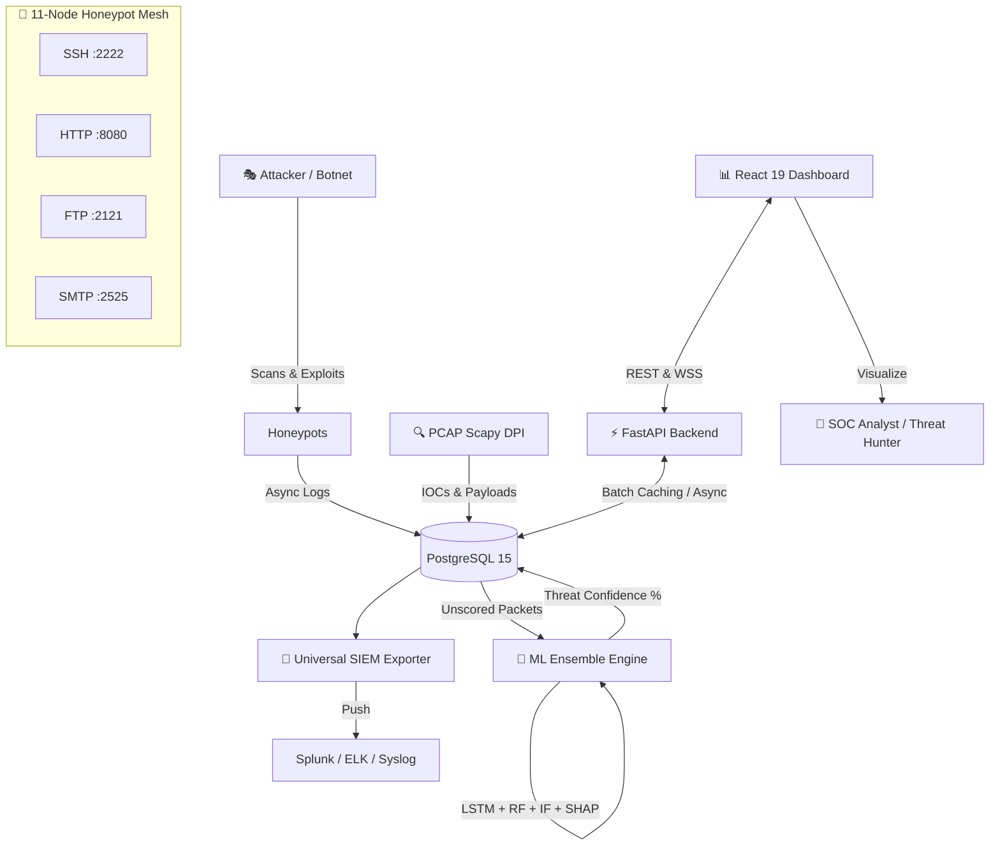

# 🛡️ PhantomNet – Adaptive AI-Driven Honeypot & Threat Intelligence Framework

<div align="center">


**An enterprise-grade, distributed honeypot mesh powered by an Ensemble AI Engine (RF + LSTM + IForest) that detects, analyzes, and responds to cyber threats in sub-500ms.**

[Executive Summary](#-executive-summary) • [Core Subsystems](#-core-subsystems--innovations) • [Architecture](#%EF%B8%8F-system-architecture) • [Installation](#-quick-start--installation) • [API](#-api--integrations) • [Team](#-team-members)

</div>

---

## 🎯 Executive Summary (Final Milestone Delivered)

PhantomNet flips the script on traditional cybersecurity. Instead of building passive walls, PhantomNet deploys a highly interactive, 11-node deceptive network mesh that lures attackers in, studies their behavior using Deep Packet Inspection (DPI), and scores their payloads using an advanced Ensemble Machine Learning model.

> **May 2026 Release Update:** PhantomNet has completed its final optimization and hardening sprint (Week 10). The platform is now fully production-ready, featuring a **Universal SIEM framework (ELK/Splunk)**, a dedicated **PCAP Analyzer Service**, **SHAP model explainability**, **DBSCAN campaign clustering**, and a breathtaking **React 19 Cyberpunk Dashboard** with 10 dedicated SOC views. All Git repository histories have been surgically cleaned of PCAP bloat for lightning-fast deployments.

---

## 🌟 Core Subsystems & Innovations

PhantomNet is built as a microservices architecture comprising over 60+ Python backend services and 99+ architectural documents. 

### 1. 🍯 Advanced Deception Mesh (11-Node Scale)
PhantomNet operates an 11-container scale honeypot infrastructure featuring advanced deception techniques:
- **SSH (Port 2222):** Dynamic banners, credential harvesting, command logging, and brute-force tarpits.
- **HTTP (Port 8080):** Fake admin panels, vulnerable file upload traps, and volumetric DDoS/flood detection.
- **FTP (Port 2121):** Directory traversal honey-folders and sophisticated log rotation.
- **SMTP (Port 2525):** Email spoofing detection and open-relay spam traps.

### 2. 🧠 Ensemble AI Threat Engine
Threats are no longer matched by static rules; they are scored by a multi-layered AI pipeline with **<100ms inference latency**:
- **LSTM Attack Predictor:** A 2-layer LSTM (128 units) tracking 50-timestep sequences to predict the *next* move an attacker will make.
- **Isolation Forest (IF):** Unsupervised anomaly baseline (contamination=0.01, 100 estimators) for zero-day payloads.
- **Random Forest (RF):** Supervised baseline for known attack heuristics.
- **Ensemble Scoring:** Final threat probability is a weighted decision: `50% RF + 30% LSTM + 20% IF`.
- **Explainable AI (XAI):** Integrated `TreeExplainer` (SHAP) provides human-readable reasons for *why* an IP was flagged.

### 3. 🔍 PCAP Deep Packet Inspection (DPI)
A dedicated `pcap_analyzer.py` service actively sniffs the wire:
- Extracts high-value Indicators of Compromise (IOCs) such as Domains, URLs, and hidden payloads from DNS/HTTP traffic.
- Uses **Scapy** to detect 6 malicious patterns natively: SYN floods, Port Scans, NULL Scans, C2 Beaconing, Data Exfiltration, and Buffer Overflows.

### 4. 🔄 Universal SIEM Integration
Designed for the modern SOC, PhantomNet ships with an Abstract Factory pattern supporting instant export to major SIEMs:
- **ELK Stack:** Logstash pipeline (`phantomnet.conf`) with GeoIP enrichment, threat-level tagging, and ILM rollovers.
- **Splunk HEC:** Native `splunk_exporter.py` supporting batch events, HEC envelope formatting, and automated retry logic.
- **Syslog/CEF:** Legacy enterprise support.

### 5. 📊 Tactical React 19 SOC Dashboard
The frontend (`phantomnet-dashboard`) is a masterpiece of React + Vite + Recharts:
- **10 Unique Views:** Main NOC, Threat Analysis, Threat Hunting, Topography, Geo Stats, Analytics, Advanced NOC, PCAP Analysis, Events, and Admin.
- **WebSockets:** Zero-latency streaming event logs and metrics.
- **Threat Hunting UI:** React query builder for deep IOC correlation and DBSCAN-based attack campaign clustering.

---

## 🏗️ System Architecture

PhantomNet relies on a fully decoupled, asynchronous event-driven design. Endpoints utilize `uvicorn` and Python `asyncio` to ensure socket checks and ML pipeline executions are entirely non-blocking (achieving sub-500ms round trips).



---

## 🧰 Full Technology Stack

| Layer | Technologies Used |
|-------|-------------------|
| **Core Backend** | Python 3.11, FastAPI, Uvicorn, asyncio, SQLAlchemy 2.0 |
| **Data & Storage** | PostgreSQL 15, Redis (IP Caching) |
| **Machine Learning** | scikit-learn, TensorFlow (LSTM), SHAP, MLflow Registry, DBSCAN |
| **Network Security** | Scapy (DPI/Sniffing), Paramiko (SSH Auth), pyftpdlib |
| **Frontend UI** | React 19.2, Vite (Rolldown), Tailwind CSS, Recharts, Axios, WebSockets |
| **SIEM & DevOps** | Docker, Docker Compose, GitHub Actions, Splunk HEC, Logstash |
| **Quality Control** | Pytest, Locust (50+ concurrent user load testing without failure) |

---

## ⚡ Quick Start & Installation

### Prerequisites
* **Docker** (v24+) & **Docker Compose** (v2+)
* **Python** (3.11+) & **Node.js** (v18+)
* **Hardware Profile:** Minimum 4GB RAM required for the ML Ensemble.

### 🐳 Instant Production Deployment (Recommended)
Launch the entire massive multi-container stack in under 60 seconds:

```bash
# 1. Clone the repository
git clone https://github.com/sriram21-09/PhantomNet.git
cd PhantomNet

# 2. Deploy all services (DB, Backend, Frontend, Honeypots, PCAP Analyzer)
docker-compose up -d

# 3. Verify System Health
docker-compose ps
```

### 💻 Local Development Setup

#### Backend Engine (FastAPI)
```bash
cd backend
python -m venv venv

# Activate Environment
venv\Scripts\Activate.ps1   # Windows
source venv/bin/activate    # Linux/Mac

# Install 60+ dependencies
pip install -r requirements.txt

# Start Async API Server
uvicorn main:app --host 127.0.0.1 --port 8000 --reload
```

#### Frontend Dashboard (React)
```bash
cd frontend-dev/phantomnet-dashboard
npm install
npm run dev
```

### 🌐 Key Access Points
| Service | URL / Command | Purpose |
|---------|---------------|-------------|
| **SOC Dashboard** | `http://localhost:3000` | Main User Interface (React) |
| **API Swagger Docs** | `http://localhost:8000/docs` | Interactive OpenAPI Specification |
| **SSH Honeypot** | `ssh -p 2222 admin@localhost` | Trigger SSH Brute-force traps |
| **HTTP Honeypot** | `http://localhost:8080/admin` | Trigger Web Flood traps |
| **FTP Honeypot** | `ftp localhost 2121` | Trigger Directory Traversal traps |

---

## 📂 Project Structure

```text
PhantomNet/
├── backend/                  # FastAPI Application & Microservices
│   ├── api/                  # 30+ REST and WebSocket Routes
│   ├── core/                 # ML Ensemble Engine & SIEM Exporters
│   ├── models/               # SQLAlchemy DB Schemas & Migrations
│   └── tests/                # Pytest Suites & Locust Load Tests
├── frontend-dev/             # React 19 Frontend App
│   └── phantomnet-dashboard/ # 15+ UI Components, Hooks, & Views
├── honeypots/                # Custom Python-based Protocol Traps
│   ├── ssh_honeypot.py       # Tarpits & Credential Harvester
│   ├── http_honeypot.py      # Volumetric Analysis
│   └── ftp_honeypot.py       
├── ml/                       # Machine Learning Training Pipelines
│   ├── MLflow_Registry/      # Model Tracking & Versioning
│   └── models/               # Pre-trained RF, IF, and LSTM weights
├── docs/                     # 99+ Architectural Docs & Playbooks
├── docker-compose.yml        # Orchestration Config (11 Nodes)
└── requirements.txt          # Python Master Dependencies
```

---

## 🔬 Testing, Performance, & Security Hardening

PhantomNet is fortified for enterprise deployments, having completed a massive Phase 3 optimization and audit:
- **Zero API Bottlenecks:** Endpoints completely refactored to `async/await` handling 50+ concurrent requests gracefully with ~13ms average responses via `Locust`.
- **Smart IP Caching:** Repeated attacks from the same IP bypass the heavy ML pipeline using a 60s TTL IP cache, saving massive computational overhead.
- **Clean Git History:** Large, stale PCAP files and config bloat have been permanently purged, ensuring a lightweight and completely conflict-free repository.
- **RBAC & Zero Trust:** API secured via JWT with strict Role-Based Access Control (Admin/Analyst/Viewer). Honeypots operate in strictly isolated Docker namespaces.

---

## 📜 Outstanding Technical Debt & Future Roadmap

As PhantomNet transitions from an academic capstone to an open-source enterprise tool, the following low-priority technical debt remains tracked for future releases:
- [ ] **Windows DPI Limitations:** Scapy requires `Npcap` natively on Windows (Works flawlessly on Linux/Docker out-of-the-box).
- [ ] **API Rate Limiting:** Planned implementation of FastAPI middleware for aggressive rate limiting to protect the dashboard backend.
- [ ] **E2E Testing:** Expanding UI test coverage using Cypress or Playwright.
- [ ] **Splunk Templates:** While the Kibana dashboard `.json` is included, the Splunk equivalent dashboard template is pending creation.

---

## 👥 Meet the Team

| Role | Name | GitHub | Email |
|------|------|--------|-------|
| **Team Lead / Architect** | Kasukurthi Sriram | [@sriram21-09](https://github.com/sriram21-09/) | sriramkasukurthi2109@gmail.com |
| **Security Developer** | Muramreddy Vivekanandareddy | [@VivekanandaReddy2006](https://github.com/VivekanandaReddy2006) | vivekuses2006@gmail.com |
| **AI/ML Developer** | Nattala Vikranth Chakravarthi | [@Vikranth-tech](https://github.com/Vikranth-tech) | nvikranth007@gmail.com |
| **Frontend Developer** | Satti Sai Ram Manideep Reddy | [@sairammanideepreddy2123](https://github.com/sairammanideepreddy2123) | sairammanideepreddy2123@gmail.com |

---

## 🤝 Contributing

We welcome security researchers, data scientists, and UI developers! Please review our extensive `docs/CONTRIBUTING.md` which covers our PR standards, branch naming conventions, and ML retraining lifecycle.

```bash
git checkout -b feature/advanced-c2-detection
git commit -m "[ML] feat: Added DBSCAN clustering for C2 beacons"
git push origin feature/advanced-c2-detection
```

## ⚖️ License & Acknowledgments

* Architecture inspired by the **OWASP Honeypot Project**.
* Special thanks to our Faculty Advisor and the open-source maintainers of FastAPI, React, Scapy, and Scikit-Learn.

---
<div align="center">
  <b>Detecting Threats Before They Strike</b><br>
  <i>Built with ❤️ by the PhantomNet Team</i><br>
  <code>Last Updated: May 2026 | Milestone: 20/20 Features Complete</code>
</div>